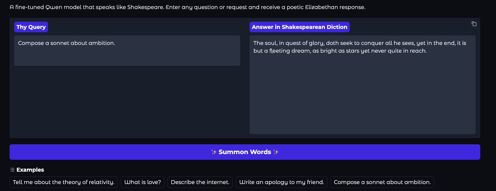

# Qwen3-1.7B — Shakespearean LoRA

A lightweight LoRA fine-tuned version of Qwen3-1.7B that responds in
**Shakespearean diction** while preserving the reasoning strength of
the base model.

The uploaded

- dataset: https://huggingface.co/datasets/Sachinkry/shakespearean-diction-dialogue
- fine-tuned model adapter: https://huggingface.co/Sachinkry/qwen3-1.7b-shakespeare-lora

## Overview

This model blends Qwen3-1.7B’s reasoning ability with the expressive
rhythm and style of Elizabethan English.  
Fine-tuned using PEFT + LoRA on a small custom dataset of 1k modern ↔
Shakespearean dialogue pairs.

- Base model: Qwen/Qwen3-1.7B
- Frameworks: transformers • peft • bitsandbytes • accelerate
- Quantization: 4-bit NF4
- GPU used: NVIDIA T4 (Colab)
- Training time: ~50 min

## Files

- `fine_tune_shakespeare_lora.ipynb` – Colab notebook for training +
  Gradio demo
- `README.txt` – this description

## Quick Start

```python
from transformers import AutoTokenizer, AutoModelForCausalLM
from peft import PeftModel
import torch

base = "Qwen/Qwen3-1.7B"
adapter = "Sachinkry/qwen3-1.7b-shakespeare-lora"

tokenizer = AutoTokenizer.from_pretrained(base)
model = AutoModelForCausalLM.from_pretrained(base, device_map="auto", load_in_4bit=True)
model = PeftModel.from_pretrained(model, adapter)

prompt = "Describe the beauty of the night sky."
msgs = [{"role": "user", "content": prompt}]
txt = tokenizer.apply_chat_template(msgs, tokenize=False, add_generation_prompt=True)
inputs = tokenizer(txt, return_tensors="pt").to(model.device)
out = model.generate(**inputs, max_new_tokens=150, temperature=0.8)
print(tokenizer.decode(out[0], skip_special_tokens=True))
```

### Gradio UI:


